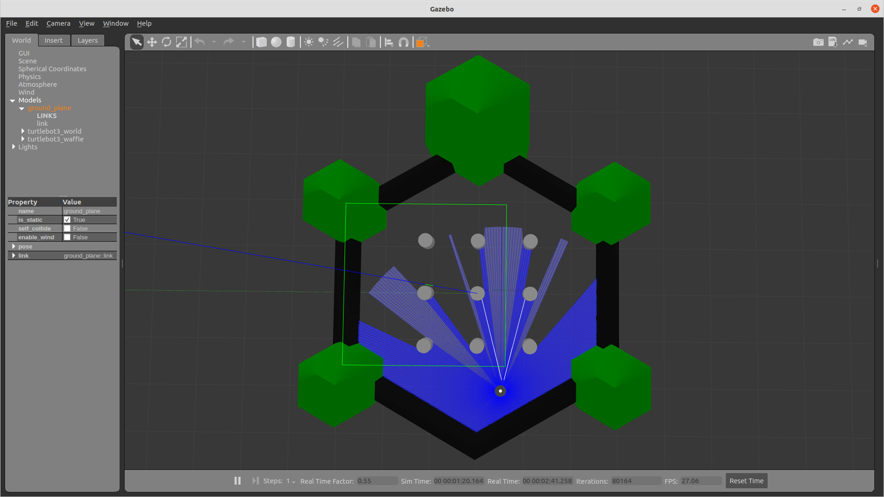
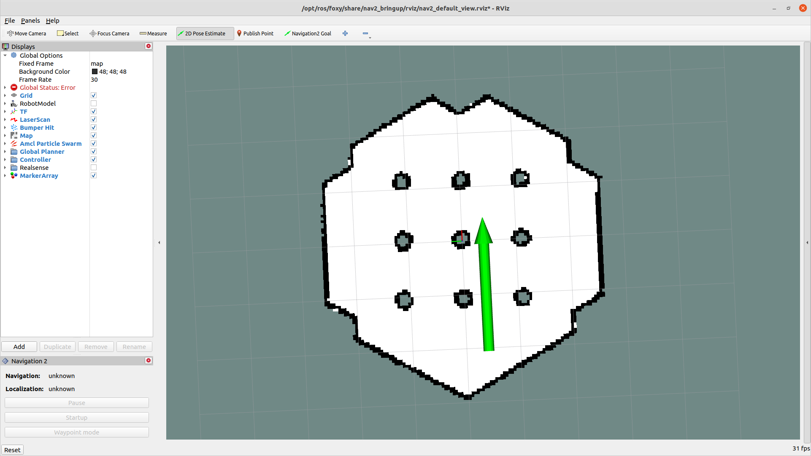
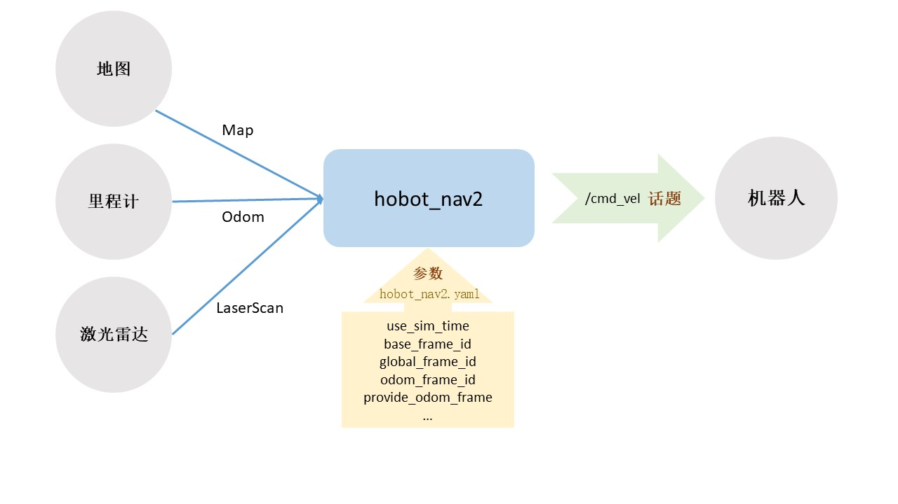
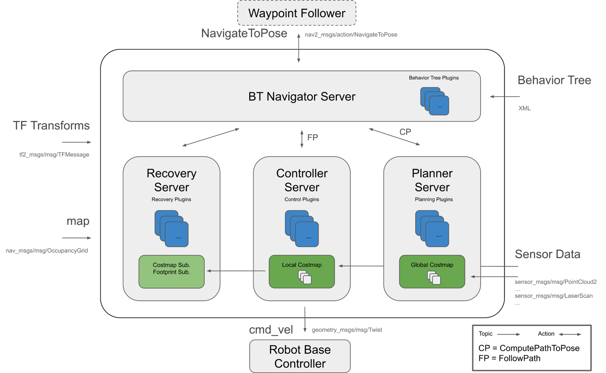

# 功能介绍

以扫地机器人为例，如何完整清扫家里每一个地方？如何躲避地图中已知的墙壁、衣柜等障碍物？静态的还好说，如果有熊孩子或者宠物，还有地面不时出现的各种杂物，机器人又该如何一一躲避？这些问题就需要一套智能化的自主导航算法来解决。

自主导航功能贯穿了移动机器人大部分的运动过程，也是智能移动机器人中至关重要的一项基础技能，机器人可以根据地图信息，有效规划出行走的路径，还要通过激光雷达或者摄像头实时识别周围的障碍物，一旦出现意外的障碍，需要立刻做出避障的动作。


# 准备工作

本Node支持在实物机器人或Gazebo仿真环境中使用，在使用前请确认具备以下条件：

## 实物机器人

本Node在实物机器人上运行时，需要机器人具备以下基本条件：

- 机器人具备运动底盘、单线激光雷达、里程计及RDK套件，硬件已经连接并测试完毕；
- 已有ROS底层驱动，机器人可接收“/cmd_vel”指令运动
- PC电脑端已经完成Ubuntu、ROS Foxy/Humble的安装

机器人示例：

| 机器人名称          | 生产厂家 | 参考链接                                                     |
| :------------------ | -------- | ------------------------------------------------------------ |
| OriginBot智能机器人 | 古月居   | [点击跳转](https://www.originbot.org/)                       |
| X3派机器人          | 轮趣科技 | [点击跳转](https://item.taobao.com/item.htm?spm=a230r.1.14.17.55e556912LPGGx&id=676436236906&ns=1&abbucket=12#detail) |
| 履带智能车          | 微雪电子 | [点击跳转](https://detail.tmall.com/item.htm?abbucket=9&id=696078152772&rn=4d81bea40d392509d4a5153fb2c65a35&spm=a1z10.5-b-s.w4011-22714387486.159.12d33742lJtqRk) |
| RDK X3 Robot        | 亚博智能 | [点击跳转](https://detail.tmall.com/item.htm?id=726857243156&scene=taobao_shop&spm=a1z10.1-b-s.w5003-22651379998.21.421044e12Yqrjm) |


## Gazebo仿真

本Node在Gazebo仿真环境中运行时，需要具备以下基本条件：

- RDK套件
- PC电脑端已经完成ROS Gazebo及Turtlebot机器人相关功能包安装


# 使用方法

## 实物机器人

> 以下操作过程以OriginBot为例，满足条件的其他机器人使用方法类似

### 搭建机器人

参考机器人官网的[使用指引](https://www.originbot.org/guide/quick_guide/)，完成机器人的硬件组装、镜像烧写及示例运行，确认机器人的基础功能可以顺利运行。


### 安装Node

启动机器人后，通过终端或者VNC连接机器人，点击本页面右上方的“一键部署”按钮，复制如下命令在RDK的系统上运行，完成Node的安装：

```bash
sudo apt install -y tros-hobot-nav2
```


### 运行Node

安装完成后，即可参考以下步骤运行该功能：

**1.启动机器人底盘**

启动机器人及激光雷达，如OriginBot的启动命令如下：

```bash
ros2 launch originbot_bringup originbot.launch.py use_lidar:=true
```


**2.启动nav2**

启动一个新的终端，通过如下指令启动nav2导航功能：

```bash
# 设置ros与tros的软链接
sudo python3 /opt/tros/create_soft_link.py --foxy /opt/ros/foxy/ --tros /opt/tros/

# 设置tros的环境变量
source /opt/tros/setup.bash

# 运行人体跟随
ros2 launch hobot_nav2 hobot_nav2_bringup.launch.py
```


**3.可视化监控导航过程**

为了便于监控机器人导航的过程，在同一网络下的PC端，启动Rviz上位机可视化软件：

```bash
# 根据所使用的ROS版本修改此处的路径
source /opt/ros/foxy/setup.bash

ros2 launch nav2_bringup rviz_launch.py
```

导航启动后，机器人最初不知道自己在哪里。默认情况下，Nav2会等待用户给机器人一个大致的起始位置。查看机器人在Gazebo中的位置，并在地图上找到该位置。通过点击Rviz2中的”2D Pose Estimate” 按钮，然后通过在地图上机器人预估的位置处点击来设置机器人初始位置 。可以通过向前拖动刚才单击的位置来设置机器人起始的移动方向。

> **注意：**
>
> 启动导航后会在终端中看到不断输出的信息，这是因为没有设置机器人初始位姿的缘故，设置初始位置后，就会停止日志刷新。


点击目标位置选择“2D Goal Pose”按钮，在地图上选择导航目标点，即可开始自主导航。


## Gazebo仿真

### 安装仿真环境

1. 参考[ROS2安装说明](https://docs.ros.org/en/humble/index.html)，在PC端的Ubuntu系统中安装ROS2

2. 在PC端的Ubuntu系统中安装Gazebo及机器人模型

```bash
sudo apt install ros-foxy-gazebo-*
sudo apt install ros-foxy-turtlebot3*
sudo apt install ros-foxy-navigation2
sudo apt install ros-foxy-nav2-bringup
```

3. 确保使用的PC与RDK处于同一网络中


### 安装Node

启动RDK后，通过终端或者VNC连接RDK，点击本页面右上方的“一键部署”按钮，复制如下命令在RDK的系统上运行，完成Node的安装：

```bash
sudo apt install -y tros-hobot-nav2
```


### 运行Node

安装完成后，即可参考以下步骤运行该功能：

**1.启动仿真环境**

在PC端Ubuntu的终端中使用如下命令启动Gazebo，并加载机器人模型：

```bash
# 根据所使用的ROS版本修改此处的路径
source /opt/ros/foxy/setup.bash

export TURTLEBOT3_MODEL=burger
ros2 launch turtlebot3_gazebo turtlebot3_world.launch.py
```

启动成功后的Gazebo仿真环境如下：




**2.启动nav2**

在RDK的系统中，启动终端，通过如下指令启动nav2导航功能：

```bash
# 设置ros与tros的软链接
sudo python3 /opt/tros/create_soft_link.py --foxy /opt/ros/foxy/ --tros /opt/tros/

# 设置tros的环境变量
source /opt/tros/setup.bash

# 运行人体跟随
ros2 launch hobot_nav2 hobot_nav2_bringup.launch.py use_sim_time:=True map:=/opt/ros/foxy/share/nav2_bringup/maps/turtlebot3_world.yaml
```


**3.查看SLAM动态效果**

为了便于监控机器人导航的过程，在同一网络下的PC端，启动Rviz上位机可视化软件：

```bash
# 根据所使用的ROS版本修改此处的路径
source /opt/ros/foxy/setup.bash

ros2 launch nav2_bringup rviz_launch.py
```

导航启动后，机器人最初不知道自己在哪里。默认情况下，Nav2会等待用户给机器人一个大致的起始位置。查看机器人在Gazebo中的位置，并在地图上找到该位置。通过点击Rviz2中的”2D Pose Estimate” 按钮，然后通过在地图上机器人预估的位置处点击来设置机器人初始位置 。可以通过向前拖动刚才单击的位置来设置机器人起始的移动方向。

> **注意：**
>
> 启动导航后会在终端中看到不断输出的信息，这是因为没有设置机器人初始位姿的缘故，设置初始位置后，就会停止日志刷新。



一旦设置好了机器人的初始位置，就会完成坐标变换树，同时Nav2将会完全激活并准备就绪。这时就可以看到机器人和点云了。


点击目标位置选择“2D Goal Pose”按钮，在地图上选择导航目标点，即可开始自主导航。


# 接口说明



## 话题

| 名称     | 消息类型                | 说明 |
| -------- | ----------------------- | ---- |
| /map     | geometry_msgs/msg/Twist |      |
| /cmd_vel |                         |      |
| /odom    |                         |      |
| /scan    |                         |      |
| /tf      |                         |      |


## 参数

| 名称            | 类型 | 默认值 | 取值范围 | 说明 |
| --------------- | ---- | ------ | -------- | ---- |
| use_sim_time    |      |        |          |      |
| base_frame_id   |      |        |          |      |
| global_frame_id |      |        |          |      |
| odom_frame_id   |      |        |          |      |

更多参数请查看hobot_nav2.yaml文件中的配置。


# 原理简介




# 参考资料

- Nav2官方文档：[点击跳转](https://navigation.ros.org/)


# 常见问题

暂无

