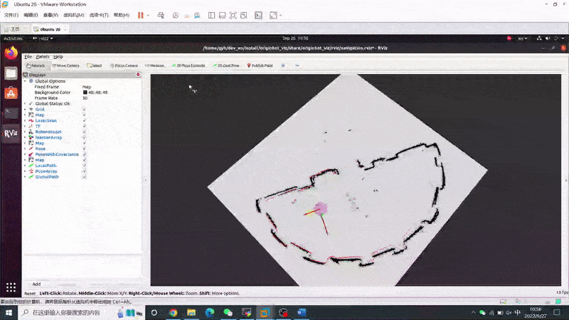

# 功能介绍

以扫地机器人为例，如何完整清扫家里每一个地方？如何躲避地图中已知的墙壁、衣柜等障碍物？静态的还好说，如果有熊孩子或者宠物，还有地面不时出现的各种杂物，机器人又该如何一一躲避？这些问题就需要一套智能化的自主导航算法来解决。

自主导航功能贯穿了移动机器人大部分的运动过程，也是智能移动机器人中至关重要的一项基础技能，机器人可以根据地图信息，有效规划出行走的路径，还要通过激光雷达或者摄像头实时识别周围的障碍物，一旦出现意外的障碍，需要立刻做出避障的动作。


# 物料清单

以下机器人均已适配RDK X3

| 机器人名称          | 生产厂家 | 参考链接                                                     |
| :------------------ | -------- | ------------------------------------------------------------ |
| OriginBot智能机器人 | 古月居   | [点击跳转](https://www.originbot.org/)                       |
| X3派机器人          | 轮趣科技 | [点击跳转](https://item.taobao.com/item.htm?spm=a230r.1.14.17.55e556912LPGGx&id=676436236906&ns=1&abbucket=12#detail) |
| 履带智能车          | 微雪电子 | [点击跳转](https://detail.tmall.com/item.htm?abbucket=9&id=696078152772&rn=4d81bea40d392509d4a5153fb2c65a35&spm=a1z10.5-b-s.w4011-22714387486.159.12d33742lJtqRk) |
| RDK X3 Robot        | 多厂家 | [点击跳转](https://developer.horizon.ai/sunrise) |

# 使用方式

## 准备工作

1. 机器人具备运动底盘、相机及RDK套件，硬件已经连接并测试完毕；
2. 已有ROS底层驱动，机器人可接收“/cmd_vel”指令运动，并根据指令正确运动；
3. 已安装Lidar驱动，能够正常发布/scan话题；
4. PC电脑端已经完成Ubuntu、ROS Foxy/Humble的安装。

## 安装hobot-nav2功能包

启动机器人后，通过终端或者VNC连接机器人，点击[NodeHub hobot-nav2](http://it-dev.horizon.ai/nodehubDetail/170117036053371397)右上方的“一键部署”按钮，复制如下命令在RDK的系统上运行，完成人体跟随相关Node的安装。

```bash
sudo apt update
sudo apt install -y tros-hobot-nav2
```

## 运行nav2

这里以OriginBot为例，不同品类机器人前面三步执行命令可能有所差别

**1.启动机器人底盘**

启动机器人，通过终端或者VNC连接机器人，OriginBot的启动命令如下：

```bash
# 设置tros的环境变量
source /opt/tros/setup.bash

# 设置ros的环境变量
source /opt/ros/foxy/setup.bash

# 启动OriginBot
ros2 launch originbot_base robot.launch.py 
```

**2.启动激光雷达**

通过终端或者VNC连接机器人，激光雷达启动命令如下：

```bash
# 设置tros的环境变量
source /opt/tros/setup.bash

# 设置ros的环境变量
source /opt/ros/foxy/setup.bash

# 运行激光雷达
ros2 launch ydlidar_ros2_driver ydlidar_launch.py
```

**3.启动nav2**

启动机器人后，通过终端或者VNC连接机器人，点击本页面右上方的“一键部署”按钮，复制如下命令在RDK的系统上运行，完成Node的安装：

```bash
# 设置tros的环境变量
source /opt/tros/setup.bash

# 设置ros的环境变量
source /opt/ros/foxy/setup.bash

# 运行nav2
ros2 launch hobot_nav2 hobot_nav2_bringup.launch.py
```

**4.可视化监控导航过程**

为了便于监控机器人导航的过程，在同一网络下的PC端，启动Rviz上位机可视化软件：

```bash
# 根据所使用的ROS版本修改此处的路径
source /opt/ros/foxy/setup.bash

ros2 launch nav2_bringup rviz_launch.py
```

导航启动后，机器人最初不知道自己在哪里。默认情况下，Nav2会等待用户给机器人一个大致的起始位置。查看机器人在Gazebo中的位置，并在地图上找到该位置。通过点击Rviz2中的”2D Pose Estimate” 按钮，然后通过在地图上机器人预估的位置处点击来设置机器人初始位置 。可以通过向前拖动刚才单击的位置来设置机器人起始的移动方向。

> **注意：**
>
> 启动导航后会在终端中看到不断输出的信息，这是因为没有设置机器人初始位姿的缘故，设置初始位置后，就会停止日志刷新。


点击目标位置选择“2D Goal Pose”按钮，在地图上选择导航目标点，即可开始自主导航。




# 接口说明

接口及参数调整方式可参考NAV2官方文档[NAV2调参说明](https://navigation.ros.org/setup_guides/index.html)


# 参考资料

- NAV2官方文档：[点击跳转](https://navigation.ros.org/index.html)


# 常见问题

暂无
